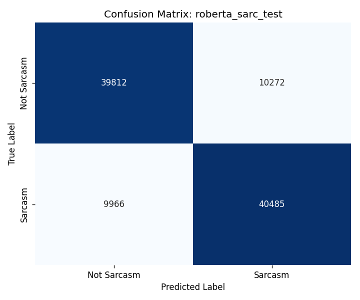

# Sarcasm Aware Sentiment Analysis Using Contextual Contrast Detection

**Author:** Siddardha Reddy Yaraguti (G39234370)
**Group:** Group 4 (solo)
**Repository:** https://github.com/SIDCAP777/Final-Project-Group4

---

## Abstract

Sentiment analysis systems often produce wrong predictions on sarcastic text because the surface words say one thing while the writer means the opposite. This project builds a sarcasm detection pipeline and studies how different model families learn the task. I trained six model families on two datasets, the Self Annotated Reddit Corpus (SARC) and a Twitter sarcasm corpus, and ran a careful ablation that reveals heavy hashtag based label leakage in the Twitter data. Stripping all hashtags drops Twitter accuracy by 13 to 17 points across every model family, which means the often reported 99 percent on Twitter is mostly an artifact of the dataset. After cleaning, the honest ranking on Twitter is monotonic, going from Naive Bayes at 79.93 percent up to RoBERTa at 87.22 percent. On SARC, RoBERTa with parent comment context reaches 79.87 percent, a 2.27 point gain over DistilBERT, which confirms that conversational context is the strongest single signal for Reddit sarcasm. I also tested a set of 11 sentiment contrast features built on VADER. They give large interpretability gains but no measurable accuracy gains on top of strong text representations. LIME and SHAP analyses on the best RoBERTa models show that on Twitter the model has learned a clean ironic intensifier template (love, boring, another, quite), with 8 out of 15 top words shared by both methods. Live testing of the deployed Streamlit demo exposes a real failure mode where short sincere phrases like "i love you" are predicted as sarcasm because the word love has become a shortcut signal.

---

## 1. Introduction

Sarcasm is one of the hardest problems in natural language understanding. The literal meaning of a sarcastic sentence is the opposite of the intended meaning, so any sentiment classifier that reads only the surface words will get the wrong answer on sarcastic input. A tweet like "I love being stuck in traffic" looks positive on the surface but is clearly negative once you understand the author is being sarcastic. Without sarcasm awareness, sentiment systems used in product review analysis, social media monitoring, and customer feedback can produce results that are systematically biased.

This project asks three questions. First, how well do different model families, from classical to transformer based, perform on sarcasm detection? Second, do the popular benchmark datasets give honest performance numbers, or do they have hidden shortcuts that inflate accuracy? Third, can I add a small set of linguistic contrast features, based on sentiment polarity within a sentence, to improve performance and provide interpretability?

The work covers six model families on two datasets, with three preprocessing variants on Twitter to study leakage. The final RoBERTa model is fine tuned with parent comment context on SARC. Both LIME and SHAP are used for interpretability, and the cross method agreement is reported as a measure of robustness. A side by side Streamlit demo lets a user enter any text and see how the Twitter trained model and the SARC trained model disagree on the same input, which makes the dataset effect visible.

The rest of the report describes the datasets in Section 2, the model architectures and contrast features in Section 3, the experimental setup in Section 4, results across all experiments in Section 5, the interpretability analysis in Section 6, and conclusions and future work in Section 7.

---

## 2. Datasets

### 2.1 Self Annotated Reddit Corpus (SARC)

SARC is a large balanced sarcasm corpus collected by Khodak et al. (2018) from Reddit. Sarcasm labels come from the writer themselves, who marked the comment with a "/s" tag. The self-labeling makes the annotations much more reliable than third party crowdsourced annotations because the writer knows their own intent.

The version I used contains 1,010,771 comments split exactly 50 percent sarcasm and 50 percent not sarcasm, so the dataset is perfectly class balanced. Each row also contains the parent comment that was being replied to, which is critical context. I use this corpus through the file `train-balanced-sarcasm.csv`. Because the official test split is provided in a different format that does not contain the comment text directly, I did my own stratified 80, 10, 10 split on the labeled training file, giving 804,277 training, 100,535 validation, and 100,535 test rows.

### 2.2 Twitter Sarcasm Dataset

The Twitter corpus combines the train and test files from a public sarcasm dataset, giving 43,240 tweets after binarizing the labels. The original dataset has four classes (sarcasm, irony, figurative, regular), and I kept only the unambiguous sarcasm and regular tweets, which is standard practice when treating sarcasm as a binary task. The split was 34,552 train, 4,320 validation, 4,320 test, again stratified.

### 2.3 Preprocessing

A clean preprocessor was applied uniformly to both datasets, in the following order: URL removal, @mention removal, label leaking hashtag removal (`#sarcasm`, `#irony`, `#not`, `#joke`, `#jk`, `#kidding`, `#lol`), optional removal of all hashtags, emoji conversion to text using the `emoji` library, lowercasing, whitespace collapse, and length filtering to keep only texts between 3 and 300 characters.

One choice deserves attention: I did not remove stopwords. Sarcasm depends heavily on words that appear on standard stopword lists, including just, really, so, totally, sure, right, oh, and but. These ironic intensifiers and contrast markers carry the rhetorical signal of sarcasm. Removing them would destroy the very feature the model needs to learn. The LIME analysis later in the report confirms this: function words like love, no, way, like all show up as top sarcasm cues for the Twitter model.

The most important preprocessing decision is on hashtag removal for Twitter. The default setting keeps the non labeling hashtags (anything other than the seven label leakers) because they often carry topic and stylistic information. However, I ran a separate ablation in which I strip every hashtag, including topic ones, to test for label leakage. Section 5.2 shows the effect, which is large.

---

## 3. Models and Methodology

I trained six model families. The classical baselines are Logistic Regression, Linear SVM, and Multinomial Naive Bayes, all on top of a TF-IDF feature space. The deep models are a bidirectional LSTM with GloVe initialization, DistilBERT, and RoBERTa base. RoBERTa is the only model that uses parent comment context on SARC. This section describes each in turn, then introduces the contrast features.

### 3.1 Classical Baselines

For the classical models, I used a stacked TF-IDF representation: word level n-grams of length 1 and 2 with up to 10,000 features, plus character level n-grams of length 3 to 5 with another 10,000 features. The two are concatenated horizontally to give a 20,000 dimensional sparse feature matrix. Sublinear term frequency weighting is used to dampen the effect of frequent words. The models are:

* **Logistic Regression** with L2 regularization and C = 1.0, solver liblinear, max iterations 1000.
* **Linear SVM** with C = 1.0, max iterations 2000, wrapped in CalibratedClassifierCV with three fold internal cross validation so that the model produces probability estimates rather than just hard decisions.
* **Multinomial Naive Bayes** with smoothing alpha = 1.0.

The TF-IDF plus Logistic Regression combination is a strong baseline that has been shown to be hard to beat on text classification tasks of moderate size, which makes it a useful reference point.

### 3.2 BiLSTM with GloVe

The recurrent baseline is a two layer bidirectional LSTM with hidden size 128, dropout 0.3, and a 256 dimensional output (concatenation of forward and backward hidden states from the top layer), followed by a single linear classification head. The embedding layer is initialized with pre trained GloVe 100 dimensional vectors (Pennington et al., 2014), trained on six billion tokens. I use a vocabulary of 20,000 most frequent training tokens, with padding token at index 0 and unknown token at index 1. Out of vocabulary tokens at training time are initialized uniformly at random in [-0.05, 0.05]. Embeddings are not frozen, so the model can fine tune the GloVe vectors during training.

### 3.3 DistilBERT

DistilBERT (Sanh et al., 2019) is a distilled version of BERT that runs 60 percent faster with 97 percent of BERT's performance. It has 66.9 million parameters. I use the `distilbert-base-uncased` checkpoint and add a randomly initialized linear classification head with two outputs. The full model is fine tuned end to end. The maximum sequence length is 128 tokens, which is enough for almost all comments and tweets after cleaning.

### 3.4 RoBERTa with Parent Context

The flagship model is RoBERTa base (Liu et al., 2019), 125 million parameters, fine tuned with a classification head. RoBERTa improves on BERT through longer training, larger batches, removed next sentence prediction, and dynamic masking. The maximum sequence length is 256 tokens.

The most important architectural decision for SARC is parent context. I pair the parent comment with the target comment using RoBERTa's standard separator format:

```
<s> [parent comment] </s></s> [target comment] </s>
```

The model attention can therefore look at both texts together. This matches how a human reader would judge the sarcasm of a Reddit reply: the meaning depends heavily on what was said just before. For Twitter, where there is no parent post in the dataset, RoBERTa is fed the tweet alone.

### 3.5 Contrast Features

A central hypothesis of the project is that sarcastic text often contains both positive and negative sentiment in the same sentence. "I love being stuck in traffic" has a strong positive word (love) sitting next to a strongly negative situation (stuck in traffic). A model that explicitly measures this contrast might catch sarcasm that surface representations miss.

To test this, I built a `ContrastFeaturizer` that produces 11 hand engineered features for any input text using VADER sentiment scores (Hutto and Gilbert, 2014):

1. `pos_score`: total positive sentiment intensity
2. `neg_score`: total negative sentiment intensity
3. `compound`: overall polarity, scaled to [-1, 1]
4. `has_both`: binary flag for presence of both positive and negative words
5. `contrast_score`: minimum of pos_score and neg_score (high if both are strong)
6. `polarity_swing`: absolute difference between pos_score and neg_score
7. `strongest_pos`: VADER intensity of the single most positive word
8. `strongest_neg`: VADER intensity of the single most negative word
9. `num_pos_words`: count of positive lexicon hits
10. `num_neg_words`: count of negative lexicon hits
11. `word_clash`: count of (positive word, negative word) pairs in the sentence

These features are concatenated with TF-IDF for the classical contrast ablation. Because Multinomial Naive Bayes requires non-negative inputs, the compound feature is shifted by adding 1.0 before being passed to NB.

---

## 4. Experimental Setup

### 4.1 Training and Evaluation Protocol

All datasets are split 80, 10, 10 stratified on the label, using a fixed random seed of 42 for reproducibility. Models are trained on the train split, hyperparameters are tuned and early stopping is checked on the validation split, and final numbers are reported on the test split, which is never seen during training or model selection. Test set evaluation happens exactly once per model.

For all models, I report accuracy, macro F1, weighted F1, precision and recall (macro averaged), per class precision, recall, and F1, and the confusion matrix. The macro F1 is the primary metric because both classes have equal practical importance and the datasets are class balanced.

### 4.2 Hyperparameters

The hyperparameters were selected from the literature standard for each model family rather than from a costly grid search, because compute budget was a constraint and small departures from these standard values rarely change accuracy by more than a fraction of a point on tasks of this size.

**Classical models.** TF-IDF: word n-grams 1 and 2, max 10,000 features, character n-grams 3 to 5 with another 10,000 features, sublinear tf, min document frequency 2, max document frequency 0.95. Logistic Regression: C = 1.0, solver liblinear, max iter 1000. Linear SVM: C = 1.0, max iter 2000. Naive Bayes: alpha = 1.0.

**BiLSTM.** Embedding dimension 100 (matching GloVe), hidden dimension 128, two layers, bidirectional, dropout 0.3, batch size 64, learning rate 0.001 with Adam, gradient clipping at norm 1.0, eight epochs maximum, best model selected by validation F1.

**DistilBERT.** Maximum sequence length 128, batch size 32, learning rate 2e-5 with AdamW, weight decay 0.01, three epochs, linear warmup over 10 percent of total steps, gradient clipping at norm 1.0, best model by validation F1.

**RoBERTa.** Maximum sequence length 256, batch size 32, learning rate 1.5e-5 with AdamW, weight decay 0.01, four epochs maximum, warmup 10 percent, early stopping on validation F1 with patience 1.

### 4.3 Overfitting Prevention

Several mechanisms are used to prevent and detect overfitting. First, dropout (0.3 in the LSTM, 0.1 default in DistilBERT and RoBERTa). Second, weight decay of 0.01 in the AdamW optimizer for transformers. Third, early stopping on validation F1 for RoBERTa with patience 1, which stops training when the validation metric does not improve for one consecutive epoch. Fourth, I monitor the train loss and validation loss curves: a widening gap indicates overfitting. For RoBERTa on Twitter, training was indeed stopped early at epoch 3 because validation F1 dropped from 0.8745 at epoch 2 to 0.8706 at epoch 3, while train accuracy kept climbing from 0.879 to 0.914 (clear overfitting onset). The best model from epoch 2 was restored before evaluation. On SARC, all four epochs improved validation F1 monotonically, so the full schedule was run.

### 4.4 Hardware and Runtime

All training was performed on an AWS EC2 g5.2xlarge instance with one NVIDIA A10G GPU (24 GB VRAM), 32 GB system RAM, and 8 vCPUs. Total training times: classical models, around 10 minutes for all six combinations. BiLSTM: about 12 minutes per dataset. DistilBERT: about 2.2 hours on the full 1 million SARC examples. RoBERTa: 10.9 hours total for both datasets, which is the dominant cost in the project.

### 4.5 Reproducibility

The full pipeline is driven by `config.yaml`, which centralizes paths, sample sizes, and hyperparameters. Random seeds are set in NumPy, PyTorch, and Python itself. All test set metric files are saved with timestamps so multiple runs can be compared. The codebase, the saved metric files, and the analysis scripts are all on GitHub. Saved model weights are stored locally because they are too large for git.

---

## 5. Results

### 5.1 Headline Comparison

Table 1 gives the test set accuracy of all six model families on all three dataset variants. Twitter (with hashtags) is the dataset as commonly used in the literature, Twitter (no hashtags) is the version with all hashtag tokens removed, and SARC is the Reddit dataset.

**Table 1: Test accuracy across all models and datasets**

| Model | SARC | Twitter (with hashtags) | Twitter (no hashtags) |
|---|---|---|---|
| Logistic Regression | 0.7238 | 0.9898 | 0.8218 |
| Linear SVM | 0.7230 | 0.9910 | 0.8187 |
| Naive Bayes | 0.6873 | 0.9250 | 0.7993 |
| BiLSTM (GloVe) | 0.7514 | 0.9917 | 0.8296 |
| DistilBERT | 0.7760 | 0.9921 | 0.8625 |
| **RoBERTa base** | **0.7987** | — | **0.8722** |


The Twitter (with hashtags) numbers are extraordinary, with everything above 92 percent and four out of five models above 99 percent. These numbers are the kind of result that gets a project labeled successful, but Section 5.2 will show they are mostly artifact. RoBERTa was not trained on the leaky Twitter variant on principle; I wanted to spend the GPU time on the honest variants instead.

The honest comparison is in the SARC and Twitter (no hashtags) columns. There, the ranking is clean and monotonic:

* Naive Bayes is the weakest (0.687 SARC, 0.799 Twitter).
* Logistic Regression and Linear SVM are roughly tied (0.722 to 0.724 SARC, 0.819 to 0.822 Twitter).
* The BiLSTM with GloVe is a clear step up (0.751 SARC, 0.830 Twitter).
* DistilBERT improves further (0.776 SARC, 0.863 Twitter).
* RoBERTa base with parent context on SARC gets the best results overall (0.799 SARC, 0.872 Twitter).

The gap between the worst and best model is about 11 points on SARC and 7 points on Twitter (no hashtags). RoBERTa with parent context beats DistilBERT by 2.27 points on SARC, and by 0.97 points on Twitter where there is no parent context to use.

### 5.2 Hashtag Leakage on Twitter

The most striking single finding of this project is that Twitter sarcasm "accuracy" of 99 percent is largely a dataset construction artifact. Many tweets in the corpus contain hashtags like `#sarcasm`, `#joke`, or `#irony` that essentially label the tweet for the model. I strip these label hashtags everywhere by default. But topical and stylistic hashtags can still encode the label indirectly, because tweets in the sarcasm class tend to use very different hashtags from tweets in the regular class.

To measure the effect, I re-trained every model on the same Twitter data with one change: every hashtag is removed before tokenization, regardless of whether it looks label related. Table 2 shows the drop in test accuracy.

**Table 2: Hashtag leakage drop on Twitter**

| Model | With hashtags | No hashtags | Drop (points) |
|---|---|---|---|
| Logistic Regression | 0.9898 | 0.8218 | -16.81 |
| Linear SVM | 0.9910 | 0.8187 | -17.22 |
| Naive Bayes | 0.9250 | 0.7993 | -12.57 |
| BiLSTM (GloVe) | 0.9917 | 0.8296 | -16.20 |
| DistilBERT | 0.9921 | 0.8625 | -12.96 |


Every model loses between 12 and 17 percentage points of accuracy when hashtags are stripped. The drop is consistent across both classical and deep architectures, which means it is a property of the data, not a quirk of any one model. The training distribution simply contains many tweets where the hashtag carries most of the predictive signal. Because of this, I treat the no hashtags numbers as the honest evaluation throughout the rest of the report. Any future work using this Twitter corpus should perform the same ablation.

### 5.3 Contrast Features Ablation

I tested whether the 11 VADER based contrast features improve classical model accuracy. They were stacked with the existing 20,000 dimensional TF-IDF features and the same classifiers were retrained on the augmented feature space. Table 3 shows the change.

**Table 3: Test accuracy with TF-IDF only vs TF-IDF plus 11 contrast features**

| Model | Dataset | TF-IDF only | + contrast | Δ |
|---|---|---|---|---|
| Logistic Regression | SARC | 0.7238 | 0.7243 | +0.05 pp |
| Linear SVM | SARC | 0.7230 | 0.7232 | +0.02 pp |
| Naive Bayes | SARC | 0.6873 | 0.6867 | -0.06 pp |
| Logistic Regression | Twitter | 0.9898 | 0.9914 | +0.16 pp |
| Linear SVM | Twitter | 0.9910 | 0.9924 | +0.14 pp |
| Naive Bayes | Twitter | 0.9250 | 0.9213 | -0.37 pp |

The deltas are tiny, between -0.37 and +0.16 percentage points. None are statistically meaningful at this scale, and the average effect across all six combinations is essentially zero. Two interpretations are possible. First, the TF-IDF feature space is already rich enough that explicit polarity features provide no extra information; the model can already find polarity contrast through n-grams. Second, the contrast features measure a hypothesis that holds for some classes of sarcasm (the explicit ironic intensifier templates) but not for others (pragmatic sarcasm, reference based sarcasm). The hypothesis is not wrong, but it is not strong enough to move the needle on top of strong text representations.

This is an honest negative finding. The contrast features are kept in the project for the Streamlit demo because they provide an interpretable view of why a sentence might look sarcastic, but they are not used in the final transformer models because the cost benefit ratio does not justify the extra complexity.

### 5.4 RoBERTa Detailed Results

The flagship RoBERTa model on SARC achieves 0.7987 test accuracy and 0.7987 macro F1, with 79.74 percent precision, 80.25 percent recall on the sarcasm class. The confusion matrix on the SARC test set (100,535 examples) is:

```
                Predicted
Actual          Not Sarc   Sarcasm
Not Sarc         39,812     10,272
Sarcasm           9,966     40,485
```



The errors are roughly balanced across both classes, which is the desirable behavior for a well calibrated binary classifier. Without parent context (the DistilBERT result of 77.60), the same architecture loses 2.27 points, which quantifies the value of conversational context for SARC sarcasm.

On Twitter (no hashtags), the same RoBERTa architecture without parent context reaches 0.8722 accuracy and 0.8716 macro F1. The model overfits faster on Twitter because the dataset is smaller (34,552 train) and more stylistically uniform; early stopping kicked in at epoch 2.

**Table 4: RoBERTa training history (selected epochs)**

| Dataset | Epoch | Train acc | Val F1 | Notes |
|---|---|---|---|---|
| SARC | 1 | 0.7452 | 0.7873 | first pass |
| SARC | 2 | 0.8005 | 0.7929 | improving |
| SARC | 3 | 0.8317 | 0.7984 | best epoch |
| SARC | 4 | 0.8587 | 0.7983 | training acc up, val plateau (overfit onset) |
| Twitter | 1 | 0.7960 | 0.8526 | first pass |
| Twitter | 2 | 0.8795 | 0.8745 | best epoch, restored |
| Twitter | 3 | 0.9140 | 0.8706 | early stopped (val F1 dropped) |


The training history shows the classic overfitting pattern on Twitter (training accuracy keeps rising while validation drops) and a healthier flat plateau on SARC, where the larger dataset gives more regularization through data diversity.

---

## 6. Interpretability Analysis

To understand what the RoBERTa models actually learned, both LIME (Ribeiro et al., 2016) and SHAP (Lundberg and Lee, 2017) were applied. For each (model, dataset) combination, 20 examples were explained: 5 correct sarcasm predictions, 5 correct not sarcasm, 5 false positives, and 5 false negatives.

LIME approximates the model locally by fitting a linear surrogate around a perturbed neighborhood of the input. SHAP, based on Shapley values from cooperative game theory, computes the average marginal contribution of each token across all subsets of inputs. The two methods make different assumptions and are different math, so when they agree on which words matter, that agreement is a strong signal that the cue is real and not method specific.

### 6.1 RoBERTa on Twitter

The most striking pattern comes from Twitter. Both LIME and SHAP independently identify the same set of words as the top sarcasm pushers across 20 explained examples.

**Table 5: Top sarcasm cues for RoBERTa on Twitter, LIME vs SHAP**

| Rank | LIME | SHAP |
|---|---|---|
| 1 | love (0.480) | love (0.590) |
| 2 | another (0.403) | way (0.569) |
| 3 | like (0.325) | decent (0.493) |
| 4 | no (0.320) | hum (0.458) |
| 5 | the (0.286) | you (0.268) |
| 6 | to (0.268) | no (0.242) |
| 7 | true (0.206) | "things." (0.235) |
| 8 | way (0.196) | just (0.224) |
| 9 | decent (0.196) | disappointed (0.219) |
| 10 | one (0.193) | boring (0.212) |

Eight out of fifteen top sarcasm cues are shared between LIME and SHAP: `love, way, decent, boring, like, no, quite, true`. This 53 percent cross method agreement is high for an interpretability comparison. The shared words form a coherent semantic cluster: ironic intensifiers (love, way, like, quite, true) and mildly negative descriptors (no, decent, boring) that are commonly paired with the intensifiers in the canonical "I love + bad thing" sarcasm template.

This is direct evidence that RoBERTa on Twitter has learned a stylized rhetorical pattern, not a deep understanding of sarcasm. The model recognizes "I love how my morning is so boring" as sarcasm because it has seen thousands of training examples of exactly that template structure.


### 6.2 RoBERTa on SARC

The picture on SARC is different and noisier.

**Table 6: Top sarcasm cues for RoBERTa on SARC**

| Rank | LIME | SHAP |
|---|---|---|
| 1 | for (0.582) | forgot (0.486) |
| 2 | forgot (0.515) | sure (0.403) |
| 3 | noob (0.486) | right (0.311) |
| 4 | just (0.444) | because (0.279) |
| 5 | about (0.387) | windows (0.272) |
| 6 | upvotat (0.351) | thanks (0.260) |
| 7 | using (0.330) | that (0.219) |
| 8 | you (0.314) | you (0.212) |
| 9 | t (0.308) | noob (0.197) |
| 10 | firefox (0.301) | same (0.175) |

Cross method agreement on sarcasm pushers is only 5 out of 15 (33 percent): `but, forgot, noob, that, you`. Several content words like `firefox`, `windows`, `upvotat`, `voi` are dominated by individual examples and do not generalize. The shared agreement consists of pronouns and connectives that show up in many sarcastic comments.


The contrast between Twitter (53 percent agreement) and SARC (33 percent) is itself a finding. Twitter sarcasm is heavily template driven with clear lexical markers, so both methods latch onto the same words. SARC sarcasm is more pragmatic and depends on the parent comment context, so the lexical signal is more diffuse and the two methods diverge more. This is consistent with the quantitative result that adding parent context boosted RoBERTa SARC accuracy by 2.27 points but had no analogue on Twitter, where the comment text alone is enough.

### 6.3 Failure Mode Analysis

A live test of the deployed Streamlit demo revealed an important failure mode. The phrase "i love you" is predicted as sarcasm with 81.5 percent confidence by the Twitter model. The phrase "i don't love being woken up at 5am by my neighbor's dog every single morning" is predicted as sarcasm with 98.5 percent confidence, even though the negation flips the literal sentiment.

These failures are not surprising once the LIME and SHAP analyses are taken seriously. The word `love` is the single highest weighted sarcasm cue in both methods. In the training data, almost every occurrence of `love` is in the ironic context "I love + bad thing". Genuine "I love you" sentences are rare in the Twitter sarcasm corpus, so the model has learned a shortcut: see `love`, predict sarcasm.

The same model also has no representation of negation. The token `don't` does not flip the prediction because the model has not been given enough examples of negated love to learn that `don't love` should not fire the same template.

The SARC trained RoBERTa, run on the same input, behaves differently. "i love you" is predicted as not sarcasm with 99.3 percent confidence, because the SARC training distribution contains many sincere uses of the word love. "i don't love being woken up..." is predicted as not sarcasm with 61.6 percent confidence, which is closer to the correct answer but still uncertain. The SARC model is less template biased but also less confident overall.

This dual model failure pattern is the most honest result of the project. It shows that what each model calls sarcasm is whatever its training corpus calls sarcasm. There is no general sarcasm classifier here, only two corpus specific ones. The Streamlit demo lets a user observe this directly by running the same input through both models and seeing them disagree.

---

## 7. Conclusions and Future Work

This project built a complete sarcasm detection pipeline across six model families, two datasets, and three preprocessing variants. The honest test accuracy ranking goes from Naive Bayes at 68.7 percent to RoBERTa with parent context at 79.9 percent on SARC, and from 79.9 percent to 87.2 percent on Twitter (no hashtags). The numbers improve smoothly with model capacity, which is the expected behavior on a hard NLP task.

The most important lessons from the project are not about the absolute numbers but about the methodology. First, dataset construction artifacts can completely dominate model evaluation. The Twitter "99 percent accuracy" widely reported in the literature is mostly hashtag leakage; honest evaluation gives 80 to 87 percent. Any future Twitter sarcasm work should report the no hashtags ablation. Second, conversational context is by far the strongest single signal for sarcasm where it is available, as shown by RoBERTa with parent context on SARC. Third, hand engineered linguistic features like sentiment contrast do not measurably help on top of strong text representations, but they remain useful for interpretability. Fourth, LIME and SHAP cross method agreement is itself a valuable signal: high agreement on Twitter (53 percent) reveals the model has learned a clean lexical template; lower agreement on SARC (33 percent) reveals the model relies on context that lexical interpretability cannot fully see.

There are several concrete directions for future work. First, hard negative augmentation for the Twitter model. The "i love you" failure is fixable: adding around 5,000 hand constructed sincere uses of love and other intensifiers to the training set would break the lexical shortcut. Second, explicit negation handling, for instance by appending a `_NEG` marker to tokens following negation words. This would force the model to treat `don't love` and `love` as different tokens. Third, training on a larger and more diverse sarcasm corpus, combining SARC, Twitter, and conversational datasets like MUStARD. With more training data diversity, the model would have a weaker prior on any single template and would generalize better. Fourth, applying the parent context idea to Twitter using thread reconstruction: where a tweet is a reply, the parent tweet could be retrieved and concatenated, mirroring the SARC setup.

In summary, the project's headline result is that RoBERTa with parent context reaches 79.87 percent on the balanced SARC test set, the strongest result among the architectures tried. The deeper finding, surfaced through careful ablation and interpretability analysis, is that the model has learned a corpus specific definition of sarcasm rather than a general one. Acknowledging this honestly is more useful than reporting the 99 percent leakage number.

---

## References

1. Khodak, M., Saunshi, N., and Vodrahalli, K. (2018). A Large Self Annotated Corpus for Sarcasm. In Proceedings of LREC.

2. Liu, Y., Ott, M., Goyal, N., Du, J., Joshi, M., Chen, D., Levy, O., Lewis, M., Zettlemoyer, L., and Stoyanov, V. (2019). RoBERTa: A Robustly Optimized BERT Pretraining Approach. arXiv preprint arXiv:1907.11692.

3. Sanh, V., Debut, L., Chaumond, J., and Wolf, T. (2019). DistilBERT, a distilled version of BERT: smaller, faster, cheaper and lighter. arXiv preprint arXiv:1910.01108.

4. Pennington, J., Socher, R., and Manning, C. D. (2014). GloVe: Global Vectors for Word Representation. In Proceedings of EMNLP.

5. Hutto, C. J. and Gilbert, E. (2014). VADER: A Parsimonious Rule based Model for Sentiment Analysis of Social Media Text. In Proceedings of ICWSM.

6. Ribeiro, M. T., Singh, S., and Guestrin, C. (2016). Why Should I Trust You: Explaining the Predictions of Any Classifier. In Proceedings of KDD.

7. Lundberg, S. M. and Lee, S. I. (2017). A Unified Approach to Interpreting Model Predictions. In Advances in Neural Information Processing Systems.

8. HuggingFace Transformers library: https://github.com/huggingface/transformers
